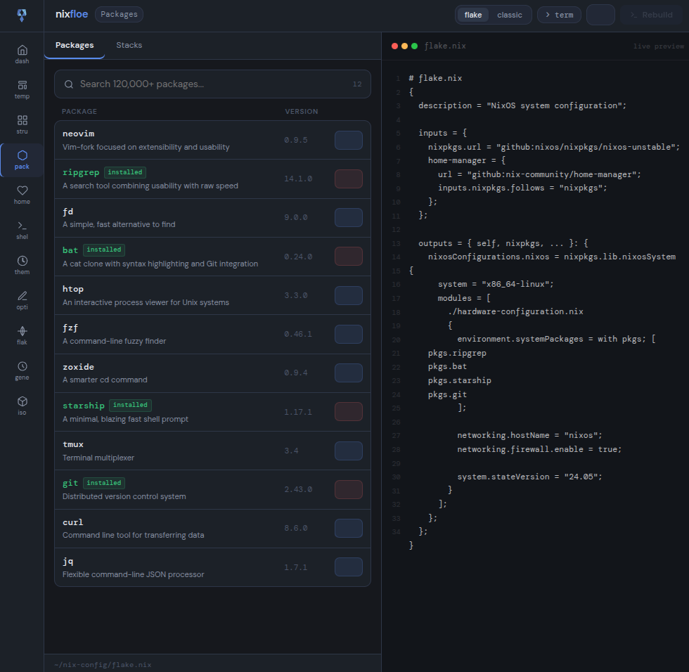
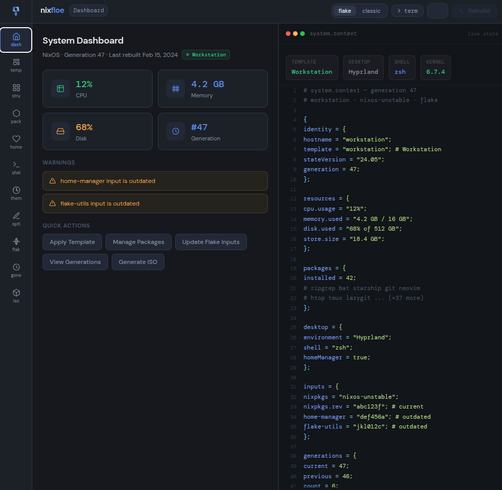
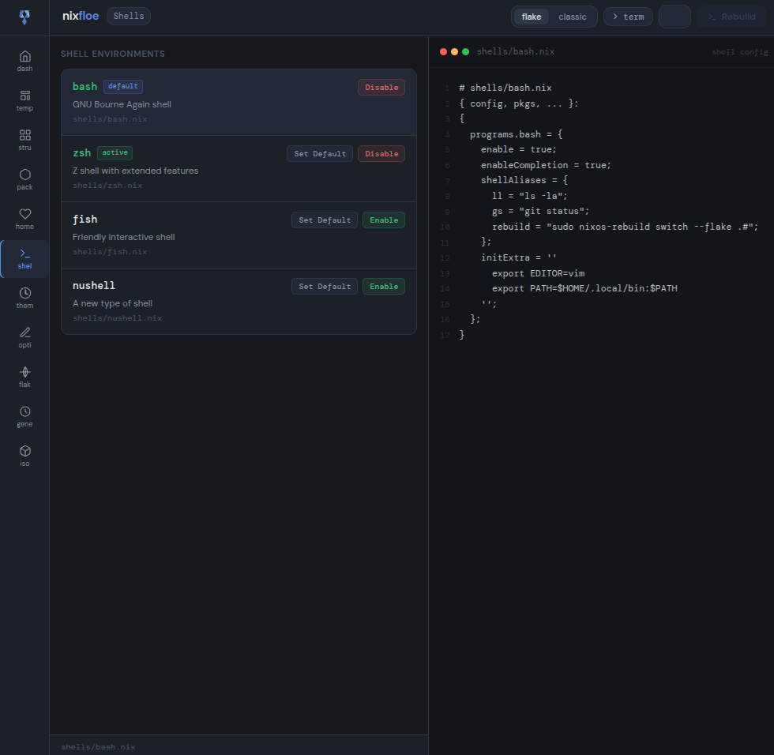
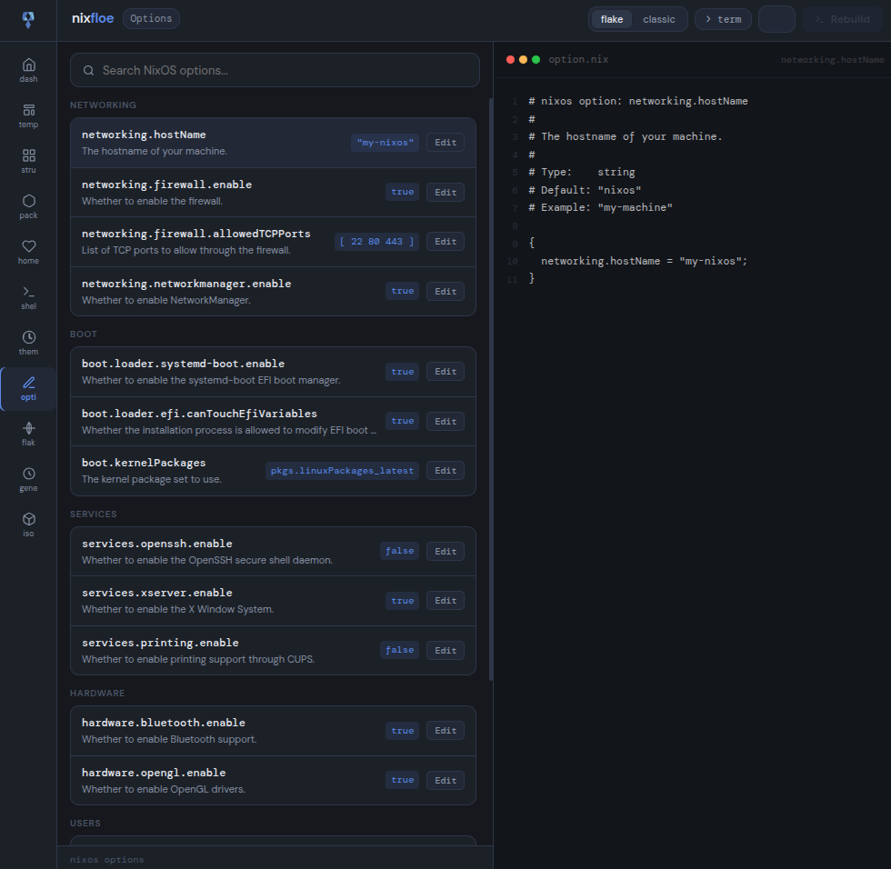
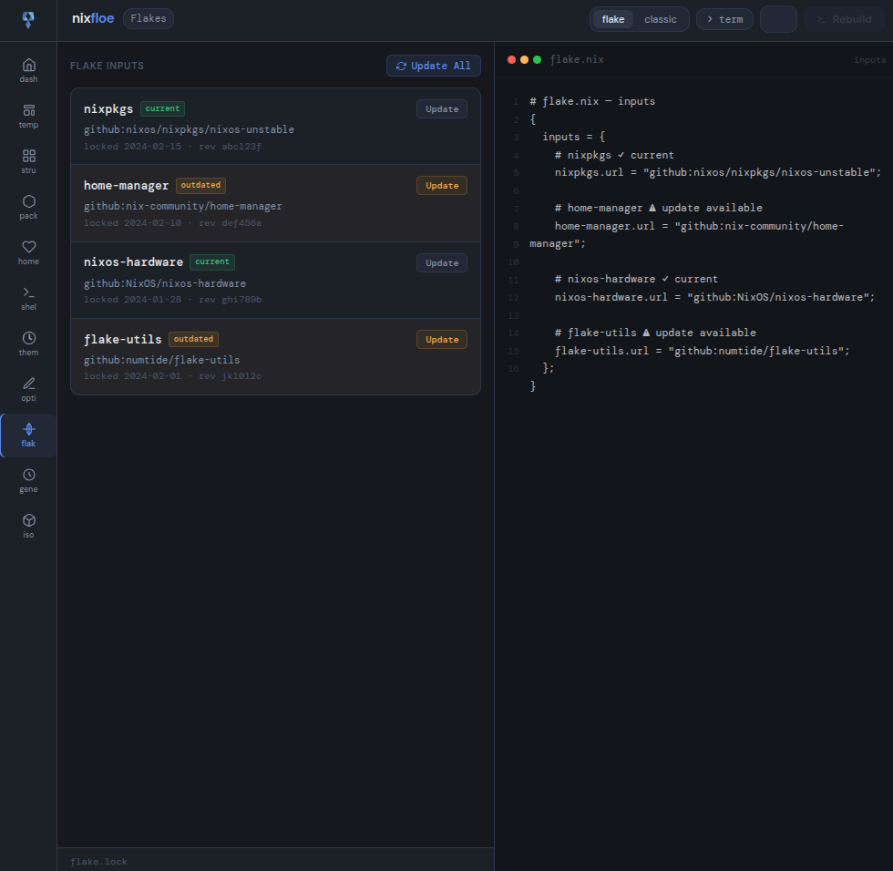
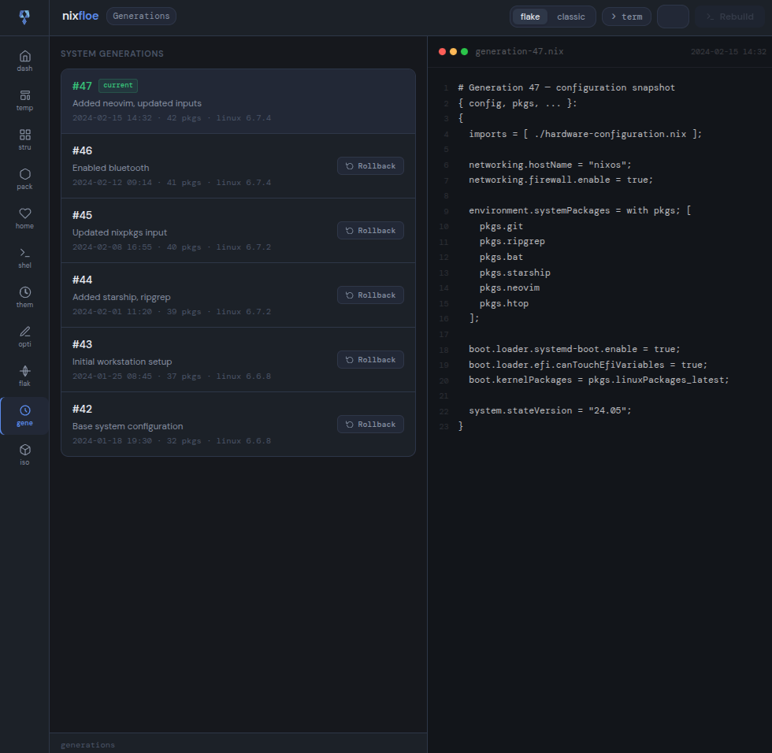

# floe

**A proposed graphical system management interface for NixOS.**

This repository contains a UI prototype. It is not a functioning application. It exists to demonstrate a vision clearly enough that people who can build it understand what it is trying to be.


https://github.com/user-attachments/assets/a5ab3210-e284-40cc-9507-09cd76851edd


---

## A note from the author

I am not a developer. AI tools allowed me to take raw ideas about an important and missing resource, substantiate them, and steward them into the community.

I have expressed the logic behind what I am doing in three related but distinct papers. Please read them to understand the approach and logic:

- [Accessible Unix](papers/accessible_unix.md) -- the philosophical foundation
- [The Collapse of the Translation Barrier](papers/translation_barrier.md) -- why this project exists at all
- [Utilizing Reproducibility for Diverse Entry Points](papers/reproducibility_entry_points.md) -- the core insight specific to NixOS

If you understand what this could be and want to help build it, that conversation is very welcome.

---

## The idea

NixOS is one of the most powerful operating systems ever created. Its declarative configuration model, reproducibility guarantees, and generation-based rollback make it uniquely capable among Linux distributions.

None of that capability is accessible to someone who has never used a terminal.

The proposal is an interface layer that changes this. Every action taken through floe would expose the underlying NixOS operation it performs. Add a package and watch the line appear in your configuration file in real time. Explore a NixOS option and see the exact nix expression it generates. Roll back to a previous generation the same way you would queue any other change. The system is never hidden. It is revealed progressively, starting from the moment you open the application.

This tool should not be a reductive simplification tool. It should be a tool that makes mastery scalable and accessible.

---

## On the GUI debate

CLI tools are great. The people who need them will find them. floe is not meant for those people. It is meant for people who need floe. If you have a problem with GUIs then simply don't use them, no one is forcing you. A lot of people genuinely need and prosper with them.

The terminal would not be hidden behind floe. It would be integrated into it. Every operation the interface performs would be visible as a real shell command. The terminal pane is a first class part of the proposed design. Anyone who opens floe and goes straight to the terminal has lost nothing and gained a capable system management environment alongside it.

---

## The prototype

The prototype demonstrates the intended interaction model across six sections. Screenshots below show what the experience is meant to feel like.

### Dashboard



An overview of system health, current generation, warnings, and quick navigation to other sections. The right panel displays current system state as readable nix.

### Packages


A package search interface connected to nixpkgs. Changes are staged as pending and applied together through a single rebuild. The right panel shows the configuration file updating in real time as packages are added or removed.


### Shells



Shell environment management. Enable or disable shells, set a default, and inspect the nix configuration for each shell in the right panel.

### NixOS Options



A browsable and searchable NixOS options tree. Click any option and the right panel shows the exact nix expression it would generate.


### Flakes



Flake input management. See which inputs are current and which have updates available. Queue updates individually or all at once.

### Generations



A full generation history. Click any generation to explore its configuration in the right panel. Queue a rollback to any previous generation as a staged change.

---

## The rebuild flow

The design proposes that every change -- packages, options, shells, flake inputs, rollbacks -- is staged before being applied. The rebuild button reflects the total number of pending changes across all sections. The rebuild terminal output is always visible, showing exactly what nixos-rebuild is doing.

---

## The two interfaces

The prototype includes a toggle between a standard visual interface and a terminal aesthetic. The terminal mode in the current prototype is not properly realized -- it is closer to a color swap than a genuine alternative personality. The intent is for it to be a fully realized TUI-feel interface that is genuinely at home next to neovim or tmux, not a reskin of the same layout. This is a design goal for the first real implementation, not a finished feature.

---

## Configuration templates

The proposal includes curated starting configurations for different use cases:

- **bare** -- a minimal NixOS installation with nothing assumed
- **entry** -- a comfortable desktop environment with sensible defaults
- **workstation** -- development tools, terminal utilities, version control
- **creation** -- audio, video, and graphics production tooling
- **gaming** -- Steam, Proton, GPU configuration, and compatibility layers
- **tutorial** -- see below

These would be reproducible NixOS configurations. Anyone who applies the same template starts from the same known state.

---

## The tutorial template

The tutorial template is the most distinct idea in this proposal. Where every other template is optimized for a use case, the tutorial template is optimized for understanding itself.

It is designed on the same principle as a tutorial level in a well-designed video game. You do not read instructions and then use the system. You use the system in a sequence designed to produce understanding at each step. Sections of the configuration would be present but commented out with explanations attached. The first rebuild would be guided. Package management would be introduced through a small curated list with a prompt to add something of your choosing.

In its most complete intended form, the tutorial template would not be selected after installation. It would be a distributable NixOS image -- a downloadable ISO, a bootable USB -- that ships with the guided experience baked in and begins on first boot. Essentially turning basic documentation into an interactive reproducible experience.

---

## Vision

My vision is for floe to become a default part of NixOS, a way for new and experienced users to configure their system in a manner that does not assume technical literacy and does not hide the system's real depth.

Additionally, given the nature of NixOS itself, a reproducible guided entry level version of the distribution would do more for adoption than anything else. floe is exceptionally suited to that environment. The biggest mistake that can be made is assuming everyone needs the exact same starting place.

---

## Roadmap of intent

**Phase one -- the package manager**
A functioning package search connected to the real nixpkgs search API. Real configuration file reading and writing. Real nixos-rebuild execution with live terminal output. Support for both flakes and classic configurations.

**Phase two -- configuration management**
The NixOS options editor connected to the real options schema. Shell management. Flake input management. The full split panel interface with live configuration preview across all sections.

**Phase three -- generations and history**
Full generation browsing with real configuration snapshots. Rollback through the standard staged change flow.

**Phase four -- templates and distribution**
Curated starting configurations for each template category. The tutorial template as a guided first-run experience. Eventually a distributable NixOS image built around floe as a front door to the ecosystem.

**What floe should never be**

- A tool that hides NixOS from users
- An imperative package manager that works against the declarative model
- A tool that makes decisions for users without showing them what is being decided

---

## Contributing

Contributions, bug fixes, improvements, and opinions are welcome.

If you want to work on something specific, opening an issue to discuss it first is a good idea so effort is not duplicated and contributions stay coherent with the direction above.

Reading the papers linked at the top of this document before contributing will help ensure that new work fits the philosophy.

---

## Running the prototype

```bash
git clone https://github.com/DeepVoiceGamer/floe
cd floe
npm install
npm run dev
```

Open `http://localhost:5173` in your browser.

---

## License

MIT -- see [LICENSE](LICENSE)

---

*floe is independent and not affiliated with the NixOS Foundation or the nixpkgs maintainers.*
